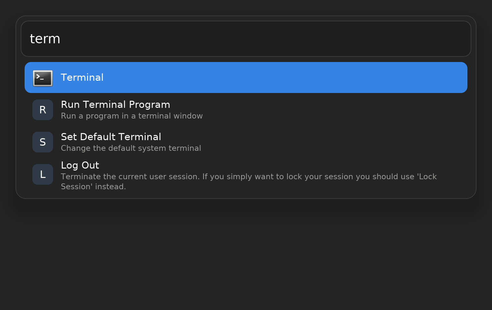
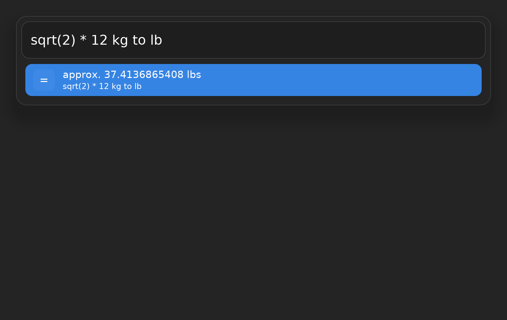
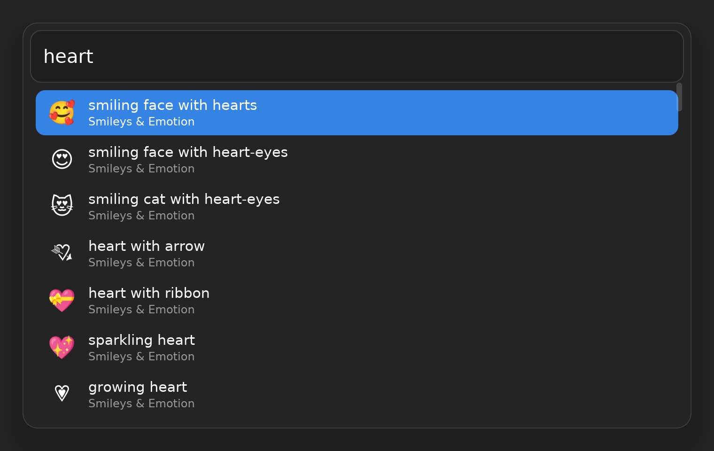
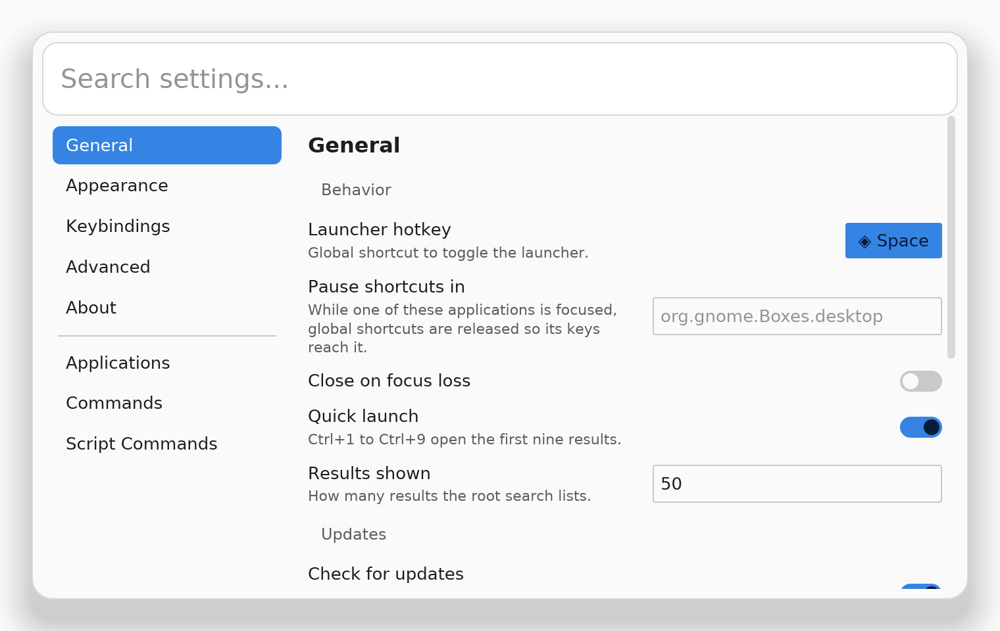

<div align="center">
  
  <h1>Compass</h1>
  <p><strong>A fast, keyboard-first launcher for the Linux desktop, written in Rust.</strong></p>
  <p>
    <a href="https://github.com/tuna-os/compass/actions/workflows/rust.yaml"></a>
    <a href="https://github.com/tuna-os/compass/actions/workflows/flatpak.yaml"></a>
    <a href="LICENSE"></a>
  </p>
  <p><a href="https://tunaos.org/compass">tunaos.org/compass</a></p>
</div>



Compass puts applications, commands, clipboard history, snippets, files, a calculator, emoji,
windows and extensions behind one search field. Press a key, type a few letters and press Enter.

It started as a hard fork of [Vicinae](https://github.com/vicinaehq/vicinae). The engine and the
UI have been rewritten in Rust, with an [Iced](https://iced.rs) interface in place of C++ and Qt.

| | |
|---|---|
|  |  |
|  | |

## Why Compass over Vicinae

**It starts sooner and uses less memory.** Both launchers were measured by the same script on the
same machine, cold-starting against the same 738-application index on a headless Wayland
compositor. The table shows medians of five runs each. The method, the raw data and the one-line
command to reproduce it are in [BENCHMARKS.md](docs/rust-engine/BENCHMARKS.md).

| | Compass | Vicinae 0.29.0 |
|---|---:|---:|
| Engine ready to answer | **96 ms** | 1,746 ms |
| Launcher populated on screen | **0.9 s** | 2.3 s |
| Keystroke to updated results | **56 ms** | 153 ms |
| Idle memory (PSS, all processes) | **218 MiB** | 263 MiB |
| Shared libraries loaded | **46** | 136 |
| Program files on disk | **72 MB** | 310 MB (AppImage, extracted) |

These are software-rendered numbers from a shared 4-core machine, so compare the ratios rather
than the absolute times. Not everything favours Compass. Per core, its fuzzy scorer is slower than
Vicinae's. Compass spreads ranking across cores, which roughly evens it out, and it runs more
threads. BENCHMARKS.md reports both results and lists what is still to measure.

**No Qt.** The binary links six system libraries: libc, libm, libgcc_s, OpenSSL and the loader.
It has no Qt, no QML and no C++ runtime. Rust makes the whole engine memory-safe: `unsafe` is
forbidden across the workspace, except in three small binding crates (SQLCipher, the Wayland
protocols, and the bridge that puts blur behind the launcher), each with a written
justification in an ADR.

**Extensions run in a sandbox.** Extensions run in separate workers behind a
[Landlock](https://docs.kernel.org/userspace-api/landlock.html) filesystem boundary and a seccomp
filter, with capped memory. The boundary also holds inside the Flatpak. Your home directory is
off-limits except for a short, named, read-only list. For example, `~/.ssh/config` is readable,
but `~/.ssh`'s keys are not. Extensions cannot run programs they downloaded. When an extension needs a program on your
computer, such as Raycast's Brew extension running `brew`, Compass asks you first: Allow Once,
Always Allow or Deny. Script Permissions lists every grant and revokes it. The policy and its
tests are in [`crates/compass-sandbox`](crates/compass-sandbox) and in the
[parity ledger](docs/rust-engine/PARITY.md).

**Scripts ask first.** Compass can also be scripted in [Rhai](docs/rust-engine/RHAI-SCRIPTS.md).
A script declares the capabilities it needs, such as reading the clipboard or opening
applications. You approve them the first time the script runs, and you can revoke them later.

**Raycast and Vicinae extensions.** Extensions written against Vicinae's Raycast-compatible
TypeScript SDK run on Compass's extension host. It implements all but a few of the SDK's 49 host
methods, including OAuth sign-in through the browser. You can browse and install from
both extension stores inside the launcher. Many Raycast extensions assume macOS; a runtime shim
maps `open` to `xdg-open`, `pbcopy` and `pbpaste` to the clipboard and Homebrew to Linuxbrew, and
refuses AppleScript by name instead of failing obscurely
([RAYCAST-LINUX-SHIM.md](docs/rust-engine/RAYCAST-LINUX-SHIM.md)).

**Made for Wayland.** On compositors that offer wlr-layer-shell, such as Sway, Hyprland and niri,
Compass draws as a layer surface, not as a window. On GNOME it uses portals and a small Shell extension, and on compositors that offer
`ext-background-effect` it blurs what is behind the translucent card. It follows the desktop's light
or dark mode live. X11 is not a target.

**Nothing phones home.** Compass has no telemetry and no news feed. It checks this repository's
GitHub releases for updates, and you can turn that check off.

**Tested where it runs.** The Rust port covers 152 of 152 feature rows in the
[parity ledger](docs/rust-engine/PARITY.md) (`python3 scripts/ci/parity-score.py`). A Bluefin VM
tier boots GNOME, installs the Flatpak and drives the real launcher on every nightly run.
`compass doctor` tells you what works on your machine and why.

## Install

### Flatpak (recommended)

Compass is published in the TunaOS Flatpak remote:

```sh
flatpak remote-add --if-not-exists tuna-os https://tunaos.org/flatpak/tuna-os.flatpakrepo
flatpak install tuna-os org.tunaos.compass
```

The runtime, `org.freedesktop.Platform//26.08`, comes from Flathub. Add Flathub too if you have
not already:

```sh
flatpak remote-add --if-not-exists flathub https://dl.flathub.org/repo/flathub.flatpakrepo
```

Then open **Compass** from your application grid.

The app ID is `org.tunaos.compass` and the command is `compass`. If you used Vicinae or an earlier
Compass build, your `~/.config/vicinae` (and its data, cache and state directories) is moved to
`~/.config/compass` on first start, with a `vicinae` symlink left behind so an older build still
finds it ([ADR-0020](docs/rust-engine/adr/0020-phase-7-rebrand.md)).

### A CI build

Every successful run of the
[Flatpak workflow](https://github.com/tuna-os/compass/actions/workflows/flatpak.yaml) uploads a
single-file bundle as the `flatpak-bundle` artifact. It expires after 14 days, and downloading it
requires a GitHub sign-in:

```sh
run=$(gh run list --repo tuna-os/compass --workflow flatpak.yaml \
        --branch main --status success --limit 1 --json databaseId --jq '.[0].databaseId')
gh run download "$run" --repo tuna-os/compass --name flatpak-bundle
flatpak install --user --bundle org.tunaos.compass.flatpak
```

### Build the Flatpak yourself

With `flatpak-builder` and the Freedesktop 26.08 SDK installed:

```sh
make flatpak-rust
```

[`packaging/flatpak/README.md`](packaging/flatpak/README.md) explains every sandbox permission.

### Other packages

The AppImage, the Arch `PKGBUILD` (`compass-git`) and the Nix flake (`.#compass`) are built and
smoke-tested in CI. See [`packaging/README.md`](packaging/README.md). They install
`/usr/bin/compass`.

### From source

The toolchain is pinned in `rust-toolchain.toml`, and [rustup](https://rustup.rs) fetches it:

```sh
cargo build --release -p compass
target/release/compass start
```

## Using it

```sh
compass start        # start the engine and open the launcher (what the app grid entry runs)
compass toggle       # show or hide it; bind this to a key in your compositor
compass doctor       # what works on this machine and what does not
```

When running from the Flatpak, prefix these with `flatpak run org.tunaos.compass`.

On GNOME and KDE, `start` asks the GlobalShortcuts portal for <kbd>Super</kbd>+<kbd>Space</kbd>.
On Sway, Hyprland or niri, bind `compass toggle` in your compositor config.
<kbd>Ctrl</kbd>+<kbd>B</kbd> opens the action panel, and <kbd>Esc</kbd> goes back or hides the
launcher.

Configuration lives in `~/.config/compass/compass.json` and has a
[JSON Schema](packaging/schema/compass.schema.json) that editors can use for completion. Until a
`compass.json` exists, Compass reads an existing Vicinae `settings.json` at startup.
`compass config migrate --write` converts it permanently.

When something goes wrong, [open an issue](https://github.com/tuna-os/compass/issues/new) and
include the full `compass doctor` output, your distribution and desktop, and how you installed
Compass.

## Development

```sh
make check-rust          # what Rust CI runs: fmt, clippy -D warnings, tests
just bench-compare       # the Compass-versus-Vicinae benchmarks
```

The workspace is split into `compass-*` crates: desktop entries, search, IPC, platform services,
Wayland and portals, GNOME Shell, the UI, the extension host and the sandbox. The `compass` crate
is the binary. Start with [CONTRIBUTING.md](CONTRIBUTING.md), the
[architecture decisions](docs/rust-engine/adr/README.md) and the
[render harnesses](docs/rust-engine/RENDER-HARNESSES.md).

The original C++/Qt engine is still in `src/` as a behavioural reference. It is not built into
any Compass package.

## Credits

Compass is derived from [Vicinae](https://github.com/vicinaehq/vicinae), by its maintainers and
contributors, and is distributed under the same [GPL-3.0](LICENSE) license. Vicinae's design, its
extension ecosystem and its C++ engine are the foundation this project builds on. If you want the
original Qt launcher, or macOS and Windows support, use Vicinae.
