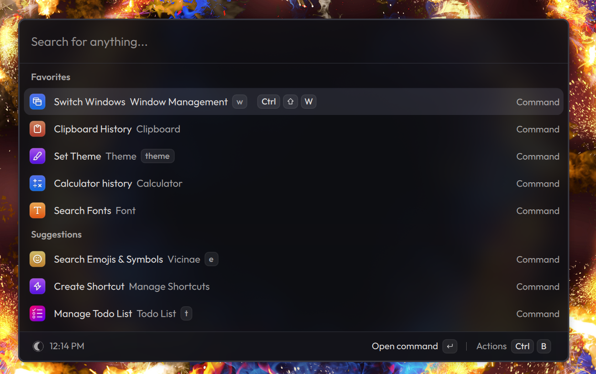

<div align="center">
  
  <h1>Compass</h1>
  <p><strong>A fast, extensible command palette for Linux—being rebuilt in Rust.</strong></p>
  <p>
    <a href="https://github.com/tuna-os/compass/actions/workflows/rust.yaml"></a>
    <a href="https://github.com/tuna-os/compass/actions/workflows/flatpak.yaml"></a>
    <a href="LICENSE"></a>
  </p>
</div>



<p align="center"><em>The feature-complete launcher UI. The Rust UI is replacing it incrementally behind parity gates.</em></p>

Compass puts applications, commands, clipboard history, snippets, files, calculations, emoji,
windows and extensions behind one keyboard-first interface. It is a hard fork of
[Vicinae](https://github.com/vicinaehq/vicinae), with the Linux engine and UI being migrated from
C++/Qt to a modular Rust workspace.

## Migration status

The Rust port is active and **not yet the default engine**. `main` currently carries both engines so
behaviour can be compared before cutover. The public project name is Compass; the `vicinae` binary,
Flatpak ID, socket, config paths and extension API names remain temporarily compatible with existing
installations. See [ADR-0012](docs/rust-engine/adr/0012-compass-public-brand.md).

- [Transformation plan](docs/rust-engine/PLAN.md)
- [Parity ledger](docs/rust-engine/PARITY.md)
- [Roadmap epic](https://github.com/tuna-os/compass/issues/2)
- [Architecture decisions](docs/rust-engine/adr/README.md)

**Where it stands: 70 of 158 parity cells are green (44%), across 3,099 tests.** Both figures are
measured rather than estimated — `scripts/ci/parity-score.py` counts the ledger and `make
check-rust` reports the tests — and the [parity ledger](docs/rust-engine/PARITY.md) is the source
of truth for any single row.

Done, in the sense that the row is green or its remaining files are backends: the builtins, the
extension host (45 of tsapi's 49 methods), the clipboard store, the search and ranking semantics,
the desktop-entry layer, and ten of the file indexer's fifteen files.

Not done, and this is the part a percentage hides: the remainder is **12 drawing gaps and 7 that
need a live D-Bus, MPRIS or a compositor**, plus two process, one storage and one network item.
The same script prints that breakdown beside the percentage, because a ledger at 44% whose
remainder is transcription and one whose remainder is compositor integration are not the same
project.

What is verified on a real desktop, not just in unit tests: a Bluefin VM tier boots GNOME under
QEMU, installs the Flatpak, and asserts that the engine starts without painting, finds
applications, finds a Flatpak installed in the system root, opens a window,
receives a typed query in *our* field, hides and returns, and opens the action panel on Ctrl+B —
the frame assertions each against a control frame from the same boot, with the changed region
required to lie inside the window. Everything else in `compass-ui` is covered by its own tests
only.

The Flatpak check is there because its absence hid a real bug for as long as this tier has
existed. A Flatpak's exported `.desktop` is a symlink into the application's deploy tree, and the
sandbox was granted the exports directory but not the tree it points into — so every Flatpak on a
user's machine was invisible, silently, with no error anywhere ([#105]). The tier could not see
it: Compass lives in a named extra installation here, and both of the roots the bug lived in were
empty, so an engine indexing 88 applications and zero Flatpaks looked healthy. It now installs one
application into the system root and asks the engine for it. The user root is reported as
uncovered on every run rather than passed over: populating a *user* installation from a container
build does not work (gpgme has no session there, and flatpak refuses `--user` as root), so it needs
a bundle staged into the image and installed in the booted session, which is a follow-up.

[#105]: https://github.com/tuna-os/compass/issues/105

## Install

> **There is no tagged release and Compass is not on Flathub yet.** Every path below builds or
> installs a development build.

**Every path below gives you the pure Rust engine, and only that.** This is worth stating plainly
because [Migration status](#migration-status) says the Rust port is not the default engine, and the
two can be read as contradicting each other. They do not: `main` carries both engines so they can
be compared, and the C++ one is what a *Vicinae* user runs today — but the Flatpak manifest here
builds `cargo build --release -p vicinae` and nothing else. There is no Qt, no CMake and no C++ in
the artifact. If you are following these instructions, the Rust engine is the only thing you get.

To confirm it on your own machine rather than taking that on trust, `doctor` reports which engine
is running. The binary *is* the engine: `--engine cpp` parses and is reported, and makes
engine-dependent commands refuse rather than quietly doing the Rust thing.

**What you can actually do with it today.** Open the launcher, type, move the selection, press Enter
to launch, and press <kbd>Ctrl</kbd>+<kbd>B</kbd> for the action panel. Run it resident and summon
it with `toggle`. It draws light or dark to match the desktop, and follows it when you switch. That is the honest list. A great deal more is *ported* — the clipboard store, the
extension host, the calculator, the emoji picker, snippets, quicklinks and most of the builtins —
but ported means the logic and its tests exist, not that the launcher can reach it yet. The
[parity ledger](docs/rust-engine/PARITY.md) is per-row about which is which.

**Requirements.** A Wayland session; GNOME is the first target and the only one covered by CI.
There is no X11 fallback — the engine is Wayland-only by design. The Flatpak paths also need
`flatpak` and access to Flathub for the `org.freedesktop.Platform//26.08` runtime.

### From a CI build

The quickest way to get a binary. Every successful run of the
[Flatpak workflow](https://github.com/tuna-os/compass/actions/workflows/flatpak.yaml) uploads a
single-file bundle as the `flatpak-bundle` artifact. Artifacts expire after 14 days and downloading
them requires being signed in to GitHub.

With the [`gh` CLI](https://cli.github.com):

```sh
run=$(gh run list --repo tuna-os/compass --workflow flatpak.yaml \
        --branch main --status success --limit 1 --json databaseId --jq '.[0].databaseId')
gh run download "$run" --repo tuna-os/compass --name flatpak-bundle

flatpak remote-add --if-not-exists --user flathub https://flathub.org/repo/flathub.flatpakrepo
flatpak install --user --bundle com.vicinae.Vicinae.flatpak
```

Or download `flatpak-bundle` from a run page in a browser, unzip it, and run the last two commands.

The bundle carries the application only, so the runtime still has to come from somewhere — that is
what the `remote-add` line is for. Once both are installed nothing further needs the network.

### Build the Flatpak yourself

Install `flatpak-builder` and the Freedesktop SDK, then:

```sh
make flatpak-rust
```

This builds and installs into your user installation. See
[`packaging/flatpak/README.md`](packaging/flatpak/README.md) for what each sandbox permission in the
manifest is for and why.

### From source

Cargo builds it without any Flatpak involved. The toolchain is pinned in `rust-toolchain.toml`, so
[rustup](https://rustup.rs) will fetch the right one on first build:

```sh
cargo run -p vicinae -- ui
```

`ui` opens the launcher in the foreground and indexes and ranks in-process — it does not need an
engine running alongside it.

## Running it

```sh
flatpak run com.vicinae.Vicinae -- ui       # open the launcher
flatpak run com.vicinae.Vicinae -- doctor   # what works on this machine, and what does not
```

Start with `doctor` if something misbehaves: it reports the session type, bus, portals and index
state, and `doctor --check-only` exits non-zero when a check fails.

For the resident mode the launcher is moving to, run the engine and let a window attach to it
([ADR-0015](docs/rust-engine/adr/0015-the-launcher-window-is-resident.md)):

```sh
flatpak run com.vicinae.Vicinae -- serve    # then, from anywhere:
flatpak run com.vicinae.Vicinae -- toggle
```

`serve` asks the GlobalShortcuts portal for `LOGO+space`, which on GNOME means a permission prompt.
Pass `serve --no-hotkey` if your compositor already binds a key to `toggle`, or if there is no
GlobalShortcuts backend.

The legacy `vicinae` and `com.vicinae.Vicinae` identifiers in these commands are intentional
migration compatibility, not the public brand.

### Trying it, and what to report

A run that takes a couple of minutes and tells you whether the engine works on your machine:

1. `doctor` first. It prints the session type, bus, portals, engine and index state. If it reports
   a failure, stop there — that is the bug, and its output is the whole report.
2. `ui` to open the launcher. An empty field over a card means indexing found nothing; a list of
   applications means it worked.
3. Type a few letters of something installed. Matching is fuzzy, so `fox` should reach Firefox.
4. <kbd>Up</kbd>/<kbd>Down</kbd> to move, <kbd>Enter</kbd> to launch. The window hides as the
   application starts.
5. <kbd>Ctrl</kbd>+<kbd>B</kbd> opens the action panel over the list; <kbd>Esc</kbd> closes it, then
   closes the launcher.
6. `serve` in one terminal and `toggle` from another, to check resident mode and the portal hotkey.

Anything outside those six steps is not wired up yet rather than broken — see the list above.

When something does go wrong, [open an issue](https://github.com/tuna-os/compass/issues/new) with
the full `doctor` output, your distribution and desktop version, and whether you installed the
bundle, built the Flatpak or ran from source. `doctor` is the single most useful thing to paste:
almost every report so far has been resolved from it.

### Hacking on it

To run the same checks as Rust CI:

```sh
make check-rust
```

## Architecture

The workspace separates desktop-entry parsing, search, application state, IPC, platform services,
Wayland/portal integration, GNOME Shell integration, UI and extension APIs into `compass-*` crates.
The `vicinae` package is the compatibility CLI and binary while the cutover is underway.

New Rust code must pass formatting, Clippy with warnings denied, workspace tests, doctests, minimum
supported Rust, scorer/crypto parity, Flatpak source checks and the platform build matrix before it
is merged.

## Contributing

Start with [CONTRIBUTING.md](CONTRIBUTING.md) and the open
[roadmap issues](https://github.com/tuna-os/compass/issues). Port work should preserve observable
behaviour or update the parity ledger with evidence for an intentional difference. A C++ test may
only be removed in the same change that adds its Rust replacement.

## Project history

Compass is derived from Vicinae and remains grateful to its maintainers, contributors and sponsors.
The inherited C++ engine and TypeScript extension ecosystem are the behavioural reference during
the migration. Special thanks also go to the
[Soulver](https://soulver.app) team for allowing the project to ship SoulverCore as an optional
calculator backend on macOS.
